# Prep Work 2

- Select is the first instruction you need for any SQL statement, thats grabbing data

- Schema is used to describe a collection of tables and their relationships

- relational databases from my current understanding seems like an excel spreadsheet where data lives and you call data from the spreadsheet

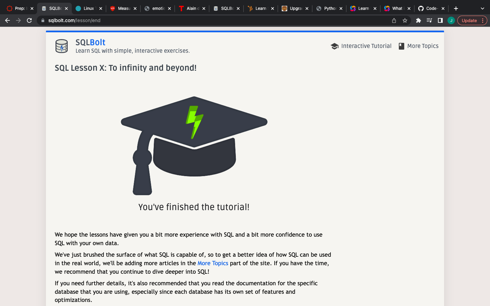screen1.png

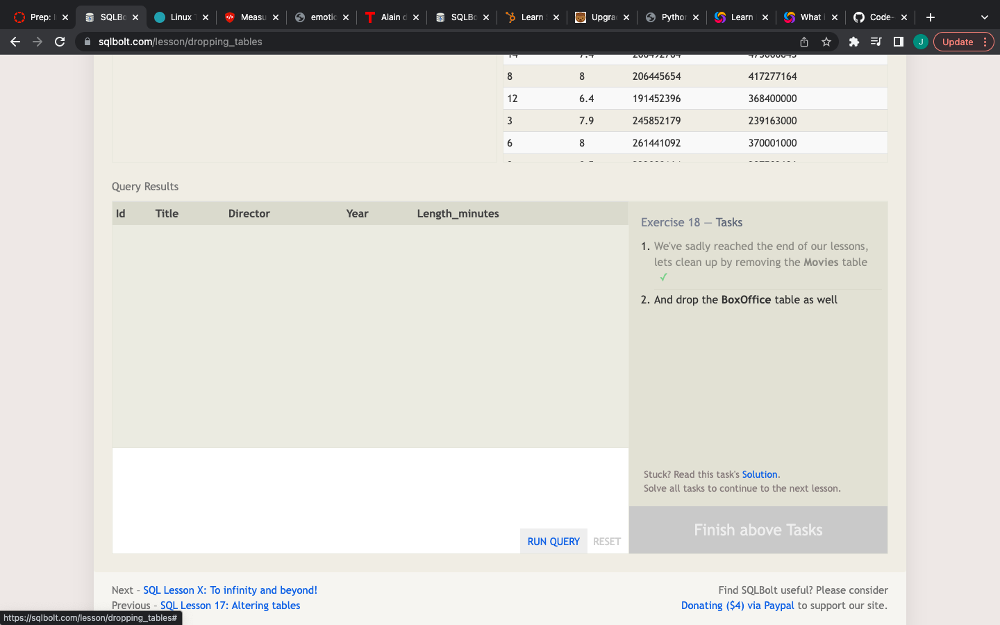screen2.png

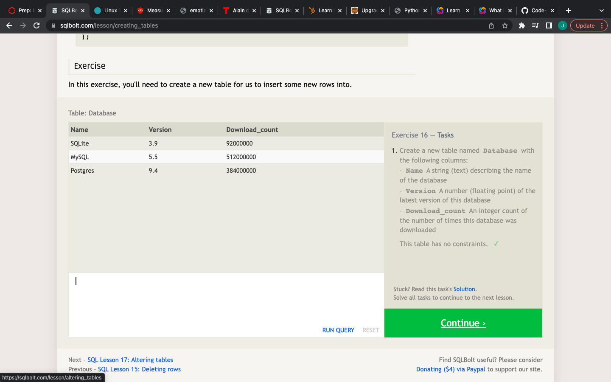screen3.png

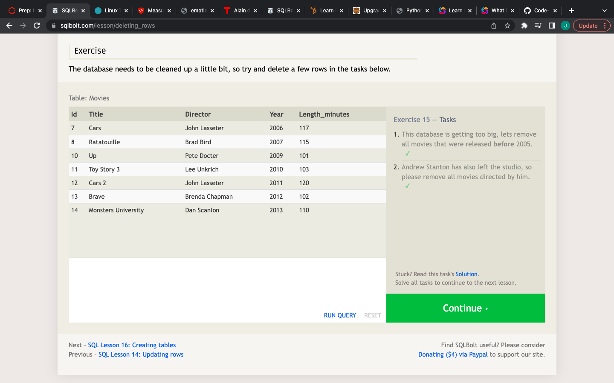screen4.png

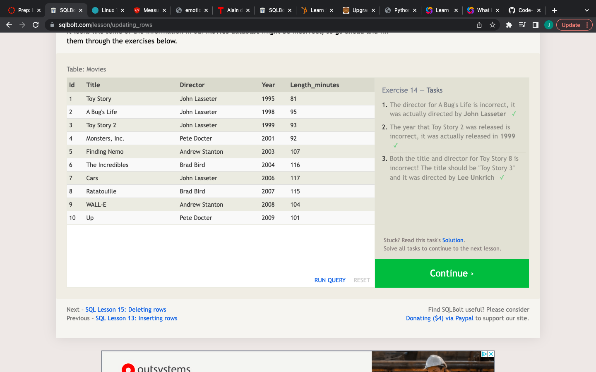screen5.png

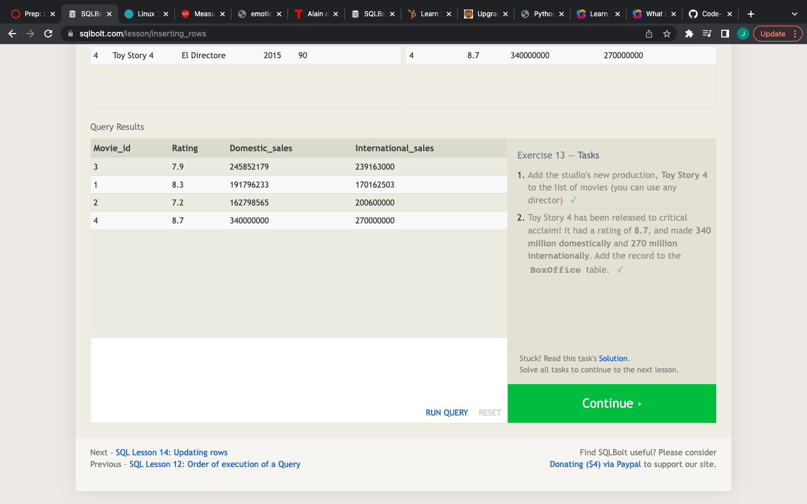screen6.png

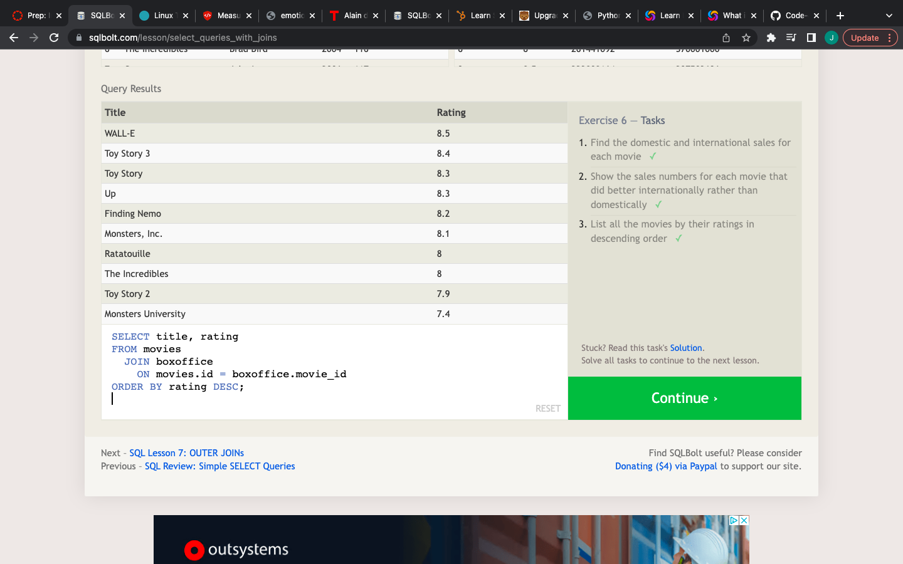screen7.png

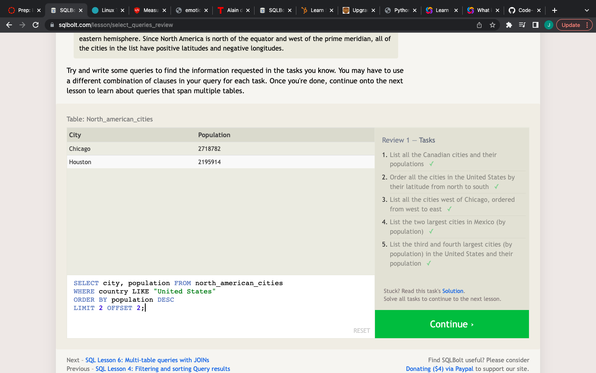screen8.png

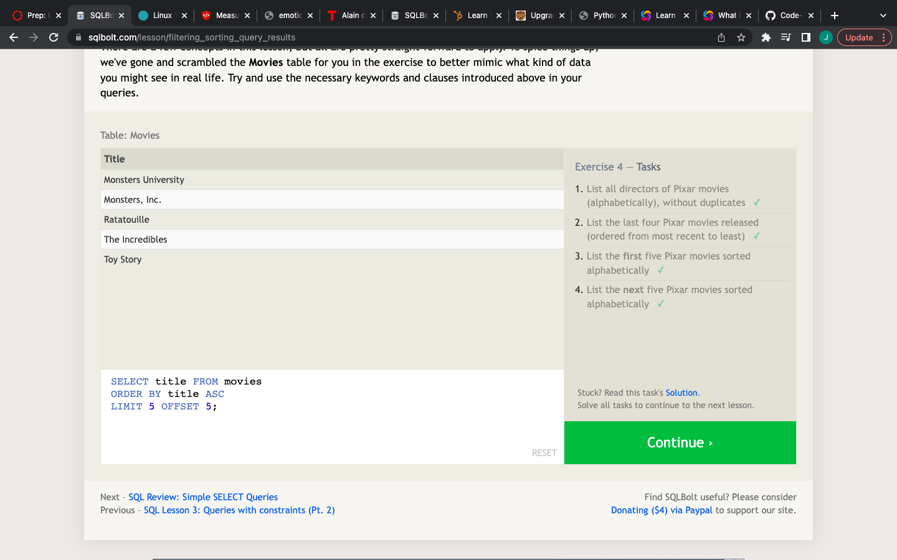screen9.png

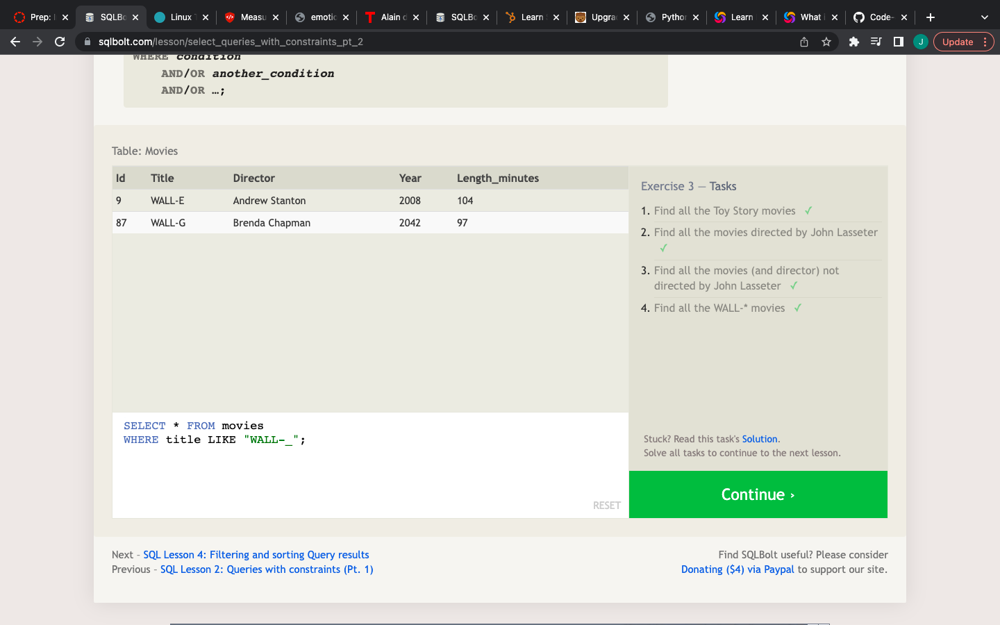screen10.png

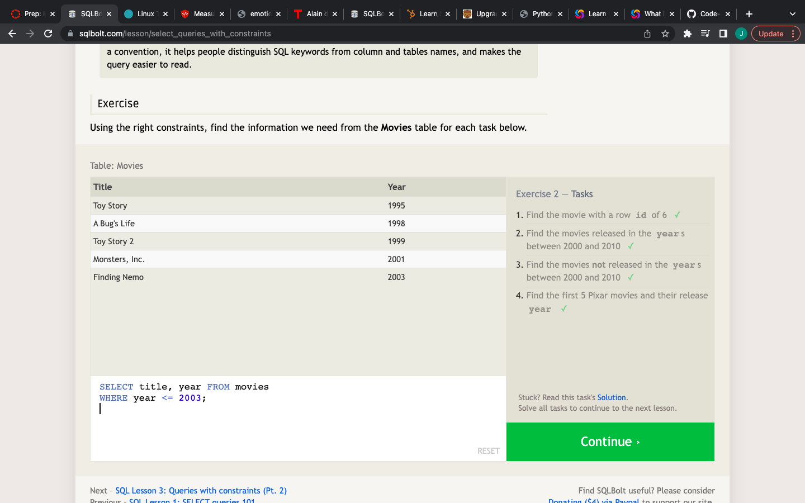screen11.png

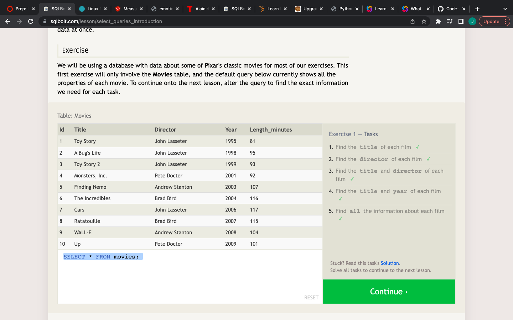screen12.png